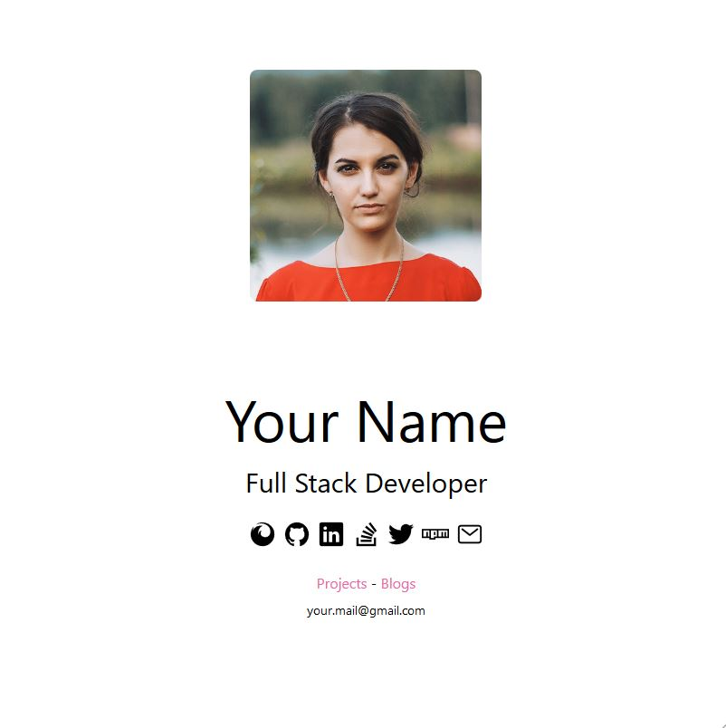
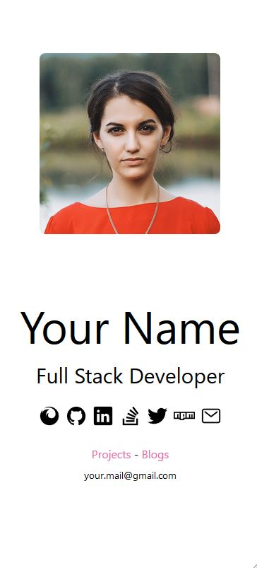

# portfolio-minimal [(Demo)](https://sivanesh-s.github.io/portfolio-minimal/)
This is for developers who thinks

**"My work and code speaks more than a Portfolio"**

A small **minimal Portfolio** for developers who are tiring of thinking about creating their own new portfolio website.

**NO WEB DEVELOPMENT SKILLS NEEDED** (If you do have, then can customize with your skills and ideas. :smile:)

## Responsive
It is fully responsible.

### Laptops

### Tabs

### Mobile

## Data for the Portfolio
You don't need to surf through HTML docs and update the data. All the data needed for your portfolio must be updated in `data.js`. (_Right now just for functionality I provided my links. You can change it_)

---